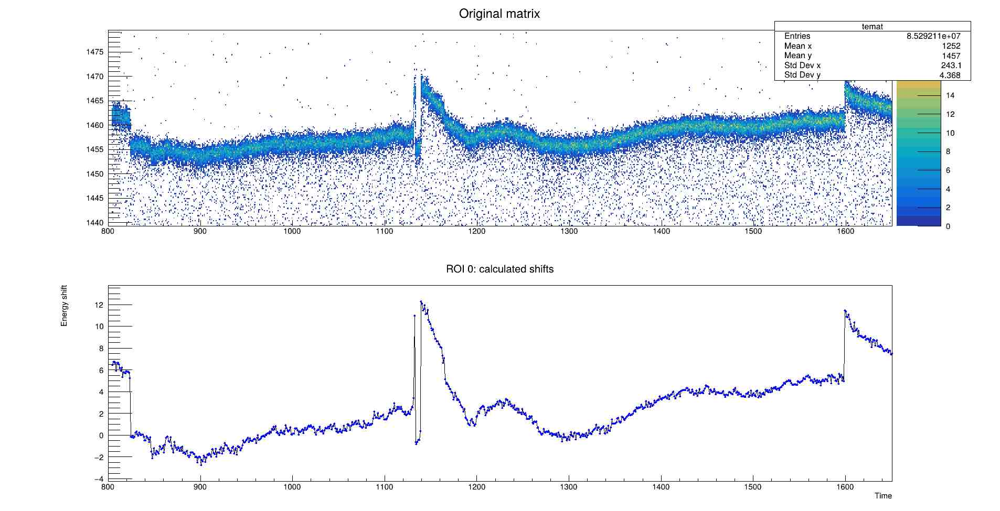

# The Cross-correlation Correction Method (CCM)

Any mistakes in the codes are purely mine, please report them to <matus.balogh@cern.ch>.

Basic description of the algorithm is given [in the NIM A paper](https://www.sciencedirect.com/science/article/pii/S0168900221003521), but the code here provides a few additional features, such as spline-based corrections. Advantage of the CCM algorithm is that it can be applied for time-varying spectra (such as beta-decays, isomeric decays etc.) and the region used to evaluate energy shifts does not need to be a peak but rather an arbitrary spectral feature unique it shape in it's vicinity. 

# Build
Prerequisities: ROOT (see https://root.cern.ch/building-root), tested with ROOT6.26/15

```bash
git clone https://github.com/matLogh/CCM.git
cd CCM
mkdir build
cd build
cmake ../
make -j4
```

Executables ```simple_example``` and ```optimizer``` will be created that are using the data set from the ```data/``` directory. Source code ```simple_example.cpp``` showcases the most basic usage of the code. The ```optimizer.cpp``` demonstrate an automated brute-force approach to find the ideal parameters of the CCM in order to obtain the best result - in this case defined as a lowest FWHM for given peak. 

Project is using *theuerkauf_fitter* submodule, that is automatically cloned when calling ```cmake```.

# How to use the code
## Basics
Algorithm requires following inputs:
- time (X axis) vs energy (Y axis) matrix (TEMAT),
- reference time window,
- at least one Region Of Interest (ROI),
- at least one energy-correcting function.

In very **simplified terms**, CCM performs energy calibration for each energy spectrum produced by single time-bin projection of the input matrix. It is done by finding *an energy shift* between a *"good/nominal/reference energy spectrum"* (defined by the reference time window) and the projected energy spectrum, but only within the *"regions of interest"* (what would be the fit region in standard energy calibration procedure). Once the energy shift is calculated, a correction function is used to recalibrate the projected energy spectrum.

**TEMAT** is an input matrix with the data. It is expected that the matrix has a time on X axis and energy on Y. Both energy- and time-binning are important parameters that significantly affects the resulting correction. It is advised to tune these for the best results; more binning == finer time corrections but also lower statistics for the code to work with.

**Reference time window** denotes a single stretch of time, in which the energy is stable/does not vary in time. It is advised to make reference time window as wide as possible to increase statistics. Reference time window is used to construct *reference vectors(s)* for each *ROI*.  

Similar to energy calibration, **ROI** defines an energy region which is used to obtain energy shift in order to convert "old" energy to "aligned" energy using the **correction function**. It should encapsulate a peak or another spectral feature () that is used to evaluate offsets. Energies are aligned to the ones defined by the reference time window. Multiple ROIs can be defined. Each ROI is defined by:
- shared_ptr to TEMAT to perform bin conversions
- *energy window* that completely encapsules a peak or spectral feature you are using for alignment in the reference energy spectrum. Window doesn't need to be symmetric around the peak/feature, I use usually 50-100 bin wide window.
- *energy displacement window* that should be at least slightly larger then maximum energy offset of the peak/spectral feature.
- *desired energy* - what energy the peak/feature should have


**Correction function** is an equivalent to the function used for energy calibration. Usually, simple gain correction ```[1]*x``` is sufficient for HPGe detectors. It must given as TF1 object that **MUST be build using TFormula constructor**, e.g.:

```cpp
TF1 fcn("gain_fcn", "[0]*x", 0, 4000); // range can be arbitrary, it is set by CCM
TF1 f("my_fcn","[0] + sqrt(x)*[1] + x*[2]", 0 ,1); 
```
Multiple correction function can be specified, correction is performed with the first function that has number of degrees of freedom equal or less then number valid ROIs. 

Once these objects are set, it is necessary to call ```CalculateEnergyShifts(int nthreads = 8)``` function that determine the energy offsets of ROIs for each time-bin of the TEMAT. Correction, or pseudo-energy-calibration functions for each time-slice is calculated by calling ```CalculateCorrectionFits( int time_subdivision = 1)``` After that is done, it is up to you to decide what output do you prefer, see next sections.

Following is a simple snippet of the code
```cpp
TFile tfile("some_data_file.root","READ");
std::shared_ptr<TH2F> TEMAT((TH2F*)tfile.Get("60Co_matrix"));
std::vector<RegionOfInterest> ROIs;
ROIs.emplace_back(TEMAT, 1300, 1360, -30, 30, 1332.5);
CCM fix(mat, ROIs, 727., 731.);
fix.CalculateEnergyShifts();
fix.CalculateCorrectionFits();

```

***


# Results

### FixMatrix
Simplest way to evaluate CCM's effectiveness is by correcting the input TEMAT, which is done by calling 
```cpp
auto fixed_matrix = fix.FixMatrix();
```
Moreover, it is possible to request correction for the matrix with much finer binning by supplying it to the overloaded function();

```cpp
std::shared_ptr<TH2F> TEMAT_large((TH2F*)tfile.Get("60Co_matrix_large"));
auto fixed_large_matrix = fix.FixMatrix(TEMAT_large);
```
You can find more on the interpolators in [in this section](#interpolators).


### Tree corrections
**Warning this functionality is currently not available because it was not tested after recent updates. Let me know if you need it.**
Event by event corrections can be applied by user-supplied TTree. CCM creates a clone of the tree (including unused branches) and apply correction on the content of the energy branch. TTree is expected to contain a single-value branches for time(stamp) and energy. For enhanced corrections a [spline interpolation](#spline-interpolation) can be used by specifying ```time_subdivision``` parameter, which essentially divides the range of each time-bin of the TEMAT into given number of sub-ranges with unique correction function.  

```cpp
void FixTree(const std::string &tfilename, const std::string &treename, const std::string &e_branchname,
                         const std::string &ts_branchname, const bool valid_only = true,
                         const int time_subdivision = 1);
```
### Tables
#### Shift table

Shift table contains energy shift between reference/nominal position of ROI and the sample ROI, produced by energy projection of given time bin of TEMAT. It can be created by calling 
```cpp
void SaveShiftTable(const std::string &table_filename);
```
Table is written in following format (written also in the table header)
```
# number of ROIs (regions of interest) in the matrix
# desired_energy_ROI0 desired_energy_ROI1 ...
#########
# time_bin time_start time_end ROI0_ok ROI0_shift ROI1_ok ROI1_shift ...
```

#### Fit table
Fit table contain correction function (in string format suitable for TFormula) and its parameters for given time. It is created by calling
```cpp
void SaveFitTable(const std::string &data_filename, const std::string &detector_name)
```
in following format (written also in the table)
```
# detector_name
# time range covered by this file
# number of correction functions used
# fcn_name number_of_parameters function_equation(TFormula style)
##############################
# time_start time_stop fcn_name number_of_parameters par0 par1 ...
```

#### ROOT file

A ROOT file containing the most detailed information about of the calculations can be created by calling
```cpp
void SaveToRootFile(const std::string &outroot_file = "ccm_output.root");
```
It contains 
- original TEMAT,
- corrected TEMAT (if created), 
- TTree for each ROI,
- list of TF1 correction functions used for energy corrections,
- TTree with parameters for energy corrections for each time bin of original TEMAT.

The ROI trees grants access to full information on the cross-correlation method used to evaluate energy shift for all time bins of original TEMAT. This includes:
- *fit_valid*; flag for validity of the calculated shift,
- *bin_shift*; shift in "bin-energy values",
- *energy_shift*; shift in energy units,
- *dot_product*; value of maximum dot product, 
- *dp_vector*; n-dimensional vector of dot products calculated between reference vector and test vector (n-dimension = number of shifts of test vector),
- *gfit_chi2*; chi2 of the [Gaussian fit](#validity-of-the-calculated-shift) of the *dp_vector* around the region of *dot_product*,
- *gfit_sigma*; sigma of the [Gaussian fit](#validity-of-the-calculated-shift) of the *dp_vector* around the region of *dot_product*,  
- *gfit_mu*; mu of the [Gaussian fit](#validity-of-the-calculated-shift) of the *dp_vector* around the region of *dot_product*,
- *time*; time


***


# Detailed description and advanced options
#### Multiple runs/multiple detectors
In case you want to find corrections for the same detector in multiple runs, e.i. you need to re-use *reference vector* from one matrix to fix another one(s), you can manually define or recycle the *reference vector*. Normally it is obtained from the *reference time window* for each ROI. Easiest way to accomplish this is with recycling is to create CCM object for matrix #1, call 
```cpp
CCM fix1(...);
...
size_t ROIno = 0;
auto ref_vec = fix1.GetReferenceVector(ROIno)
``` 
and feed it to the CMM object of matrix #2 by calling 
```cpp

CCM fix2(...);
...
fix2.SetReferenceVector(ROIno, ref_vec)
```

## Calculating displacement

As mentioned in the NIM paper, the maximum dot product for a set of displacement of a given ROI-vector and reference-vector yields only integer value, which provides only limited precision. A floating point value can be obtained by performing a fit of the dot product distribution. However, precise fit would require apriori knowledge of the analytical function resulting from convolution of the "spectral features" (defined in the ROI bounds) with itself, but this is not possible to achieve in general. Therefore, a simple *pol2* fit of 9 points around the maximum dot product and floating point value of the shift is calculated from the maximum of the fitted function. 

Although it is not possible to know analytical function describing the convolution, it is reasonable to expect that resulting dot product distribution is peak-shaped. Therefore, a Gaussian fit of limited number of values around the maximum is performed in addition to the polynomial. You can switch between the two results by calling
```cpp
void UseGaussianResult();
```
or
```cpp
void UsePolynomialResult();
```


## Validity of the calculated shift
By default all shifts are marked as valid, unless the energy projection of given time-bin is 0: such bins are expected as one usually produces matrices with some empty time padding to make sure that TEMAT contain all the data.

User can however mark some shifts as valid/invalid manually by calling 
```cpp
void SetResultStatus(const int ROI_no, const int time_index,const bool valid);
```
where the input is the ROI number (indexing from 0) and the index of time-projected spectrum (index from 0, basically bin number minus 1). The decision can be made based on the data stored in the ```ResCont``` structure obtained by calling 
```cpp
const ResCont *GetResultContainer(const int ROI_no, const int time_index);
```
Function returns ```nullptr``` in case of wrong inputs. This container holds 
- *fit_valid*; flag for validity of the calculated shift,
- *bin_shift*; shift in "bin-energy values",
- *energy_shift*; shift in energy units,
- *dot_product*; value of maximum dot product, 
- *dp_vector*; n-dimensional vector of dot products calculated between reference vector and test vector (n-dimension = number of shifts of test vector)

Moreover, it contain also details on Gaussian fit of the dp_vector points around the dot product maximum:

As mentioned above, it is not possible to know analytical function describing the convolution. However, it is reasonable to expect that resulting dot product distribution is peak-shaped. Therefore, a Gaussian fit of limited number of values around the maximum is reasonable. Idea behind this is that values like chi2 and sigma should be within a reasonable range - you can see this by quickly plotting them (individually for each ROI) from the [ROOT file](#root-file). The list of variables available in the *ResCont* are 

Moreover, it contain also details on Gaussian fit, such as:

- *gfit_chi2*; chi2 of the [Gaussian fit](#validity-of-the-calculated-shift) of the *dp_vector* around the region of *dot_product*,
- *gfit_sigma*; sigma of the [Gaussian fit](#validity-of-the-calculated-shift) of the *dp_vector* around the region of *dot_product*,  
- *gfit_mu*; mu of the [Gaussian fit](#validity-of-the-calculated-shift) of the *dp_vector* around the region of *dot_product*,
- *time*; time

The distribution of *chi2* or *sigma* of the Gaussian fits for the entire matrix should be, once again, peak-shaped. It is reasonable to assume that outlaying values are product of invalid fits (due to limited statistics or other reasons) and thus their status can be manually set to invalid, as mentioned above.

## Interpolations
Simply put, what this any any other code for time correction does, is that it divides the data set into smaller time-gated energy spectra and "recalibrate" them individually. In case of CCM, the division is given by the number of time-bins of the TEMAT. However, their number is limited by available statistics. 

As mentioned few times above, CCM is calculating energy shift between the *reference vector* and the *sample vector*. Example figure of original TEMAT and calculated shifts from ```simple_example.cpp``` can be seen in the figure below 

If the observed instability is mostly smooth, which it mostly is in this example case, a subdivision in time can be used to improve results. Subdivision is done by interpolating shift values between calculated points (of same ROI). Interpolation is switched on by default or by calling 
```cpp
fix.EnableInterpolation(ROI_index);
```
or can be disabled by 
```cpp
fix.DisableInterpolation(ROI_index);
```

ROOT's built-in interpolators are used for this task, you can configure them by calling
```cpp
void ConfigureShiftInterpolator(const std::string type = "AKIMA", const bool        valid_only = true);
```
or with overloaded function
```cpp
void ConfigureShiftInterpolator(const ROOT::Math::Interpolation::Type type, const bool valid_only = true);
```
with these interpolators types:
- "POLYNOMIAL" - only for small number of points, introduces large oscillations,
- "CSPLINE" - cubic spline with natural boundary conditions,
- "CSPLINE_PERIODIC" - cubic spline with periodic boundary conditions,
- "AKIMA" - Akima spline with natural boundary conditions ( requires a minimum of 5 points)
- "AKIMA_PERIODIC" - Akima spline with periodic boundaries ( requires a minimum of 5 points)

Moreover, because I hate having free time, I also implemented **smoothing**. In several cases, it seems that the although the calculated shifts are following some smooth pattern, the calculated shifts has some noisy distribution around the perceived pattern. An idea to get rid of this noise is to smooth the shift values of the same ROI, it is done using ROOT's built in smoothers. For better understanding of the parameters and ways they work [check this ROOT's tutorial code](https://root.cern/doc/v608/motorcycle_8C.html). You can smooth shifts by calling
```cpp
void SmoothShifts(const SmootherType smoother, const double smoother_parameter, const size_t ROI_index);
```
with ```SmootherType``` being
- TEC::SmootherType::KERNEL
- TEC::SmootherType::LOWESS
- TEC::SmootherType::SUPER
Each smoother has a parameter that should be set up for best performance.

## Diagnostic
For diagnostic you can use following graph-producing functions:
```cpp
std::unique_ptr<TGraph> GetROIShifts(const size_t roi_index, const bool valid_only = true);
```
This will produce a graph of all calculated shifts of given ROI. 


```cpp
std::unique_ptr<TGraph> GetInterpolationGraph(const size_t ROI_index, const int    subdivide  = 10, const bool valid_only = true);
```
Similar as above, but more interpolated points are added (depends on the interpolator settings!).

```cpp
std::unique_ptr<TGraph> GetShiftProfile(const int  time_bin, const bool valid_only = true);
``` 
And this one will produce a plot of shift as a function of ROI's energy at given time. Useful to estimate what correction function should be used.


# Fitter
In the source files I added "my" pure C++ fitter using the Theuerkauf peak model used in the [HDTV program](https://github.com/janmayer/hdtv/tree/master). Idea and large part of the fitter code is borrowed from there.